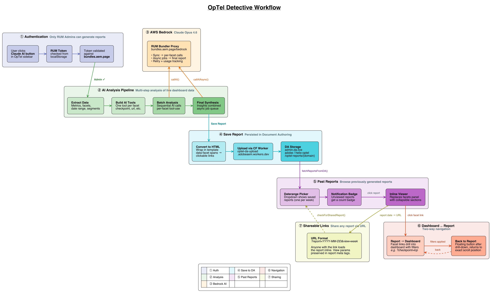

# AI OpTel Report Generator

## Overview

The AI OpTel Report Generator is an AI-powered analysis block that reads the live OpTel dashboard, analyzes all available metrics and facets using Claude, and produces a structured HTML report with prioritized, interactive insights. Reports are persisted in Document Authoring (DA) and can be viewed inline, shared via URL, and navigated bidirectionally with the dashboard.

## Why This Exists

The OpTel dashboard surfaces rich telemetry — Core Web Vitals, traffic patterns, error rates, user segments — but interpreting it requires deep technical expertise. Teams without that background struggle to identify patterns, correlate signals across facets, and prioritize what to fix. This block automates the analysis and surfaces prioritized, actionable insights accessible to anyone, regardless of technical knowledge.

## Architecture



## File Structure

```
blocks/ai-optel-report-generator/
├── ai-optel-report-generator.js   # Block entry point — modal lifecycle, auth gate
├── ai-optel-report-generator.css  # Modal and button styles
├── config.js                      # Central config — model IDs, endpoints, paths, storage keys
├── rum-admin-auth.js              # RUM token validation against bundles API
├── cleanup-utils.js               # URL param cleanup on modal close
│
├── core/
│   ├── analysis-engine.js         # Top-level orchestrator — runCompleteRumAnalysis()
│   ├── dashboard-extractor.js     # Extracts metrics, facets, date range from live DOM
│   ├── facet-manager.js           # Converts facets to AI tool definitions, handles tool calls
│   └── metrics-processing.js      # Sequential batch processing of per-facet AI analysis
│
├── api/
│   ├── api-factory.js             # Provider abstraction — callAI() and callAIAsync()
│   └── bedrock-api.js             # AWS Bedrock integration via bundles.aem.page proxy
│
├── ui/
│   ├── modal-ui.js                # Modal DOM creation, status display, results UI
│   └── progress-indicator.js      # Circular SVG progress bar with step tracking
│
├── reports/
│   ├── report-generator.js        # Generation orchestrator — wires progress, engine, save
│   ├── report-actions.js          # Save button handler, daterange picker dropdown integration
│   ├── report-viewer.js           # Inline report display, facet link navigation, back button
│   ├── report-viewer.css          # Styles for the inline report viewer
│   ├── report-state.js            # Viewed/unviewed state tracking, notification badges
│   ├── facet-link-generator.js    # Converts data-facet spans to clickable dashboard links
│   └── da-upload.js               # HTML generation, template loading, DA upload via CF Worker
│
└── templates/
    ├── system-prompt.txt           # AI system instructions for analysis tone and format
    ├── overview-analysis-template.html  # Report structure template for final synthesis
    └── report-template.html        # HTML shell for saved report files
```

## How It Works

### 1. Authentication

Only RUM Admins can generate reports. The user's token (`rum-bundler-token` or `rum-admin-token` from localStorage) is validated against `bundles.aem.page/domains`. Non-admins see a disabled button with an access-restricted message.

Entry point: `facetsidebar.js` (in `tools/optel/oversight/elements/`) creates the Claude button and lazy-loads this block on click.

### 2. Dashboard Preparation

Before analysis begins, `report-generator.js` prepares the dashboard:
- Sets `metrics=super` in the URL to load checkpoint-level data (calls `window.slicerDraw()` to refresh)
- Sets `endDate` to today to lock the date range via `fetchPrevious31Days`
- Resets cached facet tools so fresh facets are extracted
- After report generation completes, these params are removed and the dashboard is restored to its original state

### 3. Data Extraction

`dashboard-extractor.js` reads the live OpTel dashboard DOM:
- Key metrics from `.key-metrics` elements
- Date range from `<daterange-picker>`
- All facet segments from `<facet-sidebar>` (list-facet, link-facet, literal-facet, etc.)

### 4. AI Tool Construction

`facet-manager.js` scans `<facet-sidebar>` and creates an AI tool definition for each non-empty facet. Each tool supports three operations: `filter`, `analyze`, and `summarize`. Empty facets are skipped. Results are cached until `resetCachedFacetTools()` is called.

A `DOMOperationQueue` serializes filter operations to prevent DOM conflicts during concurrent tool calls.

### 5. Sequential Batch Analysis

`metrics-processing.js` processes facets one at a time:
- Creates one-tool-per-batch (configurable via `TOOLS_PER_BATCH`)
- For each batch: sends a prompt to the AI with the tool, the AI calls the tool, results are fed back as a follow-up message
- After all batches complete, a follow-up synthesis call combines all per-facet insights
- 500ms delay between batches to avoid rate limiting

### 6. Final Synthesis

`analysis-engine.js` orchestrates the end-to-end flow:
- Loads `system-prompt.txt` and `overview-analysis-template.html`
- Injects facet linking instructions via `facet-link-generator.js` (`buildFacetInfoSection()`)
- Makes an async job-queue call (`callAIAsync`) for the final comprehensive report to avoid browser timeouts
- The AI produces structured HTML with `data-facet` spans for interactive links

### 7. AWS Bedrock Integration

All AI calls go through `bundles.aem.page/bedrock` (proxied via the RUM Bundler).

`bedrock-api.js` provides two modes:
- **Sync** (`callBedrockAPI`): Used for per-facet batch calls. Includes retry logic (up to 4 attempts) with exponential backoff for 429/502/503 errors.
- **Async** (`callBedrockAPIAsync`): Used for the final report. Submits a job to `/bedrock/jobs`, then polls `/bedrock/jobs/{jobId}` every 5 seconds (max 5 minutes).

Usage tracking (`inputTokens`, `outputTokens`, `model`) is accumulated per report and submitted to `/bedrock/usage` after generation completes.

### 8. Report Persistence

`da-upload.js` handles saving:
- Wraps AI output in `report-template.html`
- Transforms content into DA-compatible table format with `<h4>` section headings
- Converts `data-facet` spans into validated, clickable `<a>` links via `facet-link-generator.js`
- Embeds `report-view` and `report-end-date` meta tags for consistent loading
- Uploads via Cloudflare Worker (`optel-da-upload.adobeaem.workers.dev`) to DA path: `adobe/helix-optel/optel-reports/{domain}/{filename}.html`

## Viewing & Sharing Reports

### Daterange Picker Dropdown

`report-actions.js` populates saved reports into the daterange picker's shadow DOM dropdown. Reports are deduplicated to one per week (most recent wins). Entries are styled as viewed/unviewed.

### Notification Badge

`report-state.js` tracks viewed reports in localStorage (`optel-detective-viewed-reports`). Unviewed reports show a count badge on the daterange picker wrapper.

### Inline Viewer

`report-viewer.js` displays reports inline by replacing the `#facets` panel:
- Fetches report HTML from DA via the CF Worker
- Parses sections (supports table, div, and h4-based layouts)
- Renders collapsible `<fieldset>` sections with formatted numbers
- Handles browser back/forward and daterange picker changes

### Dashboard ↔ Report Navigation

**Report → Dashboard:** Clicking a facet link in the report navigates to the dashboard with filters pre-applied (e.g., `?checkpoint=lcp&error.source=network`). Existing `url` and `userAgent` filters are preserved.

**Back to Report:** After drill-down, a floating + static "Back to Report" button appears (managed via `IntersectionObserver`). Clicking it restores the report view at the exact scroll position using session storage.

### Shareable Links

Reports are addressable via `?report=YYYY-MM-DD&view=week`. On page load, `checkForSharedReport()` matches the date against saved reports and opens the matching report inline. The view and endDate are restored from meta tags in the report HTML.

## Configuration

All configuration lives in `config.js`:

| Key | Purpose |
|---|---|
| `AI_MODELS.BEDROCK_MODEL_ID` | Model for batch analysis calls |
| `AI_MODELS.SYNTHESIS_MODEL_ID` | Model for final report synthesis |
| `BEDROCK_CONFIG.PROXY_ENDPOINT` | Bedrock proxy URL |
| `API_CONFIG.BATCH_MAX_TOKENS` | Max tokens per batch call (2048) |
| `API_CONFIG.SYNTHESIS_MAX_TOKENS` | Max tokens for final report (7500) |
| `DA_CONFIG.WORKER_URL` | Cloudflare Worker for DA operations |
| `DA_CONFIG.UPLOAD_PATH` | DA folder path for reports |

## Integration Point

This block is NOT loaded via CMS content. It is lazy-loaded by `tools/optel/oversight/elements/facetsidebar.js`:

1. The Claude button click loads `ai-optel-report-generator.css` and `.js`
2. Calls `window.openReportModal()` to open the generation modal
3. Separately, `report-actions.js` is lazy-loaded on sidebar init to populate saved reports in the daterange picker dropdown
